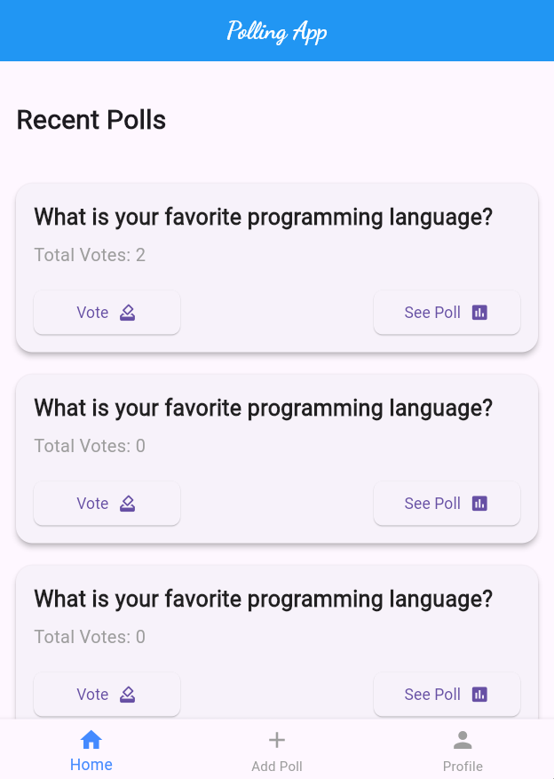
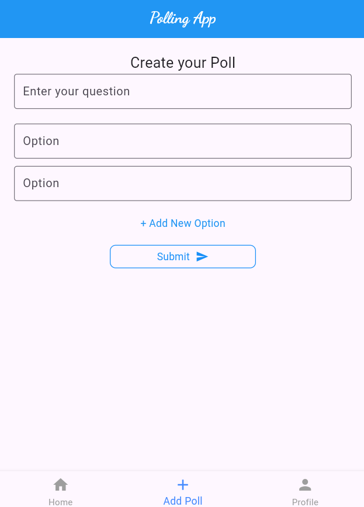
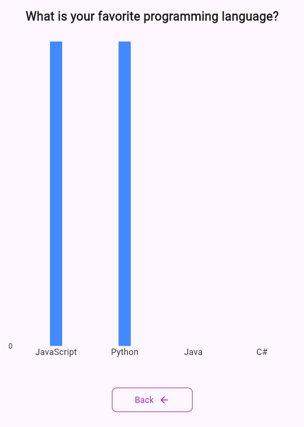

# PollApp - Create Polls & Ask for Suggestions

PollApp is a Flutter application that allows users to create polls and gather suggestions from others. It provides an interactive and engaging way to collect opinions and make informed decisions.

## 🚀 Features

- ✅ **Create Polls** - Users can create polls with multiple options.
- 🗳 **Vote on Polls** - Other users can participate by casting their votes.
- 💬 **Ask for Suggestions** - Users can seek advice or recommendations from the community.
- 📊 **Real-time Results** - View live results as votes are submitted.
- 🔔 **Notifications** - Get notified about new votes and suggestions.
- 🌍 **User-Friendly UI** - Clean and intuitive design for a seamless experience.

## 🛠 Tech Stack

- **Frontend:** Flutter (Dart)
- **Backend:** Node.js 
- **Database:** Firestore / MongoDB

## 📦 Installation

### Prerequisites

- Flutter SDK installed: [Flutter Installation Guide](https://flutter.dev/docs/get-started/install)
- Android Studio / VS Code (Recommended for development)
- Node.js (If using a custom backend)

### Steps to Run

1. **Clone the repository**
   ```bash
   git clone https://github.com/Saurav-KumarSingh/pollApp/
   cd pollApp


## 📸 Screenshots



